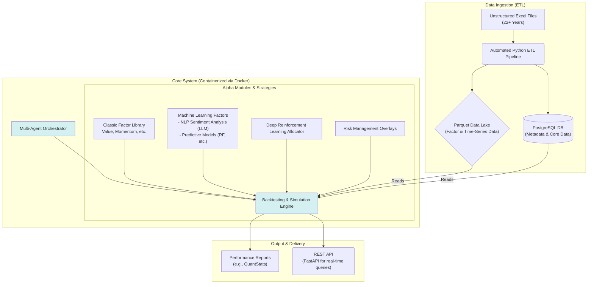

# Alphatopian: AI-Powered Quantitative Investment & Backtesting System

This repository contains the documentation for a comprehensive quantitative finance research platform. The system provides an end-to-end solution for data processing (ETL), alpha factor research, and portfolio backtesting, designed to empower investment decisions for a ~$125M AUM endowment fund.

_Note: The source code for this project is private to protect the intellectual property of the Tsing Hua Endowment Fund._

---

## 🚀 My Role: Founding Quantitative Research & Engineering Intern

As the founding intern, I led the architecture, design, and development of this 15,000+ LOC system from the ground up. I was responsible for the entire software development lifecycle, from initial concept and data modeling to final deployment and delivery of production-ready features for fund managers.

---

## 🏛️ System Architecture

The platform is designed as a modular, scalable system capable of handling complex financial data and sophisticated modeling techniques. The entire infrastructure is containerized with Docker to ensure consistency and reproducibility across all environments.

### Data Flow Explained:

1. **Data Ingestion (ETL):** An automated Python pipeline ingests over 22 years of unstructured financial data from Excel files. It intelligently parses, cleans, and structures this data, storing time-series and factor data in a highly compressed **Parquet Data Lake** for fast analytical queries, and core metadata in a **PostgreSQL** database.
2. **Core System:** The system's brain is a **Multi-Agent Orchestrator** that coordinates various modules. The **Backtesting & Simulation Engine** is responsible for executing strategies, pulling historical data from the data layer to simulate portfolio performance under different conditions.
3. **Alpha Modules:** These pluggable modules represent different investment strategies and models. They include a classic quantitative **Factor Library**, advanced **Machine Learning models** (like NLP-based sentiment analysis using LLMs), and a **Deep Reinforcement Learning** model for dynamic portfolio allocation.
4. **Output & Delivery:** The system generates detailed **Performance Reports** (using libraries like QuantStats) and exposes results via a **REST API** (built with FastAPI) for real-time queries and integration with other tools.

---

## 🛠️ Tech Stack

| Category                      | Technologies                                                                                  |
| ----------------------------- | --------------------------------------------------------------------------------------------- |
| **Language**            | Python (Expert), SQL                                                                          |
| **Backend & API**       | FastAPI, PostgreSQL, Object-Oriented Programming (OOP)                                        |
| **Data Engineering**    | ETL Pipeline Architecture, Pandas, NumPy, Parquet, Data Cleaning & Processing                 |
| **Machine Learning**    | NLP, Sentiment Analysis, LLM Application (GPT), Scikit-learn, PyTorch, Backtesting Frameworks |
| **DevOps & Infra**      | Docker, Containerization, CI/CD, Shell Scripting, Makefile                                    |
| **Software Principles** | Scalable System Design, SDLC, Agentic Workflows (LangGraph), Test-Driven Development (TDD)    |

---

## ✨ Key Features & Technical Highlights

### 1. Scalable, Automated ETL Pipeline

I designed a robust ETL system to handle the high volume and complexity of historical financial data.

* **Problem:** Raw financial data was trapped in thousands of unstructured, inconsistently formatted Excel sheets spanning over two decades.
* **Solution:** I developed an automated pipeline that programmatically identifies, parses, and cleans the target data. It transforms the raw information into a clean, query-optimized format (Parquet), making it readily available for research and backtesting. This process reduced the time for data preparation from weeks to minutes.
* **Impact:** Enabled the fund to leverage a vast dataset that was previously inaccessible, unlocking new research possibilities.

### 2. Cyclical & Conditional Agentic Workflow for Alpha Discovery

Inspired by modern AI architectures like LangGraph, I designed the multi-agent system not as a linear pipeline, but as a stateful, cyclical graph capable of automated, iterative research.

* **Problem:** Alpha discovery is not a linear process; it requires iteration, critique, and refinement. A simple sequential orchestrator cannot replicate this.
* **Solution:** The system employs a state-driven workflow where specialized agents (e.g., `Researcher`, `Coder`, `Backtester`, `Critique`) operate as nodes in a graph. A shared "State" object, containing the current hypothesis, code, and backtest results, is passed between them. Conditional logic at the `Critique` node evaluates the backtest performance and determines the next step: either finalizing the factor or looping back to the `Researcher` with constructive feedback for another iteration.
* **Impact:** Transformed the system from a simple automation tool into a semi-autonomous research platform, capable of exploring, evaluating, and refining investment strategies with minimal human intervention.

### 3. Production-Grade Machine Learning & LLM Integration

I integrated modern machine learning techniques to develop novel alpha factors that go beyond traditional financial metrics.

* **Problem:** Traditional factors often miss market sentiment and narrative-driven opportunities.
* **Solution:** I developed an NLP-based sentiment factor that ingests financial news, processes it with Large Language Models (LLMs) to score sentiment, and translates this into a quantitative signal. This model was fully integrated into the backtesting engine.
* **Impact:** Delivered a unique, production-ready alpha factor to fund managers, providing a competitive edge by capturing a new dimension of market information.

---

## 🏗️ Future-Proofing & Scalability: A Kubernetes-Ready Architecture

While the current system is efficiently deployed via Docker, the entire architecture was designed with cloud-native principles in mind, making it perfectly suited for a seamless migration to a Kubernetes (K8s) environment. This demonstrates a forward-thinking approach to scalability and resilience.

Here’s how the current components map to a K8s deployment:

* **API & Agent Services → K8s Deployments & Services:** The FastAPI server and individual agents can be deployed as scalable `Deployments`. A K8s `Service` would provide stable endpoints and load balancing, enabling high availability and effortless scaling of replicas.
* **ETL & Backtesting Tasks → K8s Jobs & CronJobs:** The automated ETL pipeline is a perfect candidate for a `CronJob`, running on a schedule to process new data. On-demand backtesting tasks can be managed as `Jobs`, allowing for massive parallel execution of hundreds of simulations without blocking core services.
* **Database → K8s StatefulSet or Managed Service:** The PostgreSQL database can be run as a `StatefulSet` with `PersistentVolumes` to ensure data integrity. Alternatively, for production-grade reliability, it can connect to a managed cloud database like AWS RDS, a common pattern in microservices architecture.

This K8s-ready design ensures the system can evolve from a powerful research tool into a large-scale, fault-tolerant production platform.

---

## 📈 Impact & Results

* **Enabled Research at Scale:** The platform supports the research and decision-making processes for a ~$125M AUM fund, with a universe of strategies applicable to ~$4B AUM.
* **Full Automation:** The end-to-end automated pipeline covers ETL, factor calculation, backtesting, and reporting.
* **Production-Ready:** Delivered tangible, high-impact features, including the NLP sentiment factor and DRL allocators, which are actively used by fund managers.
